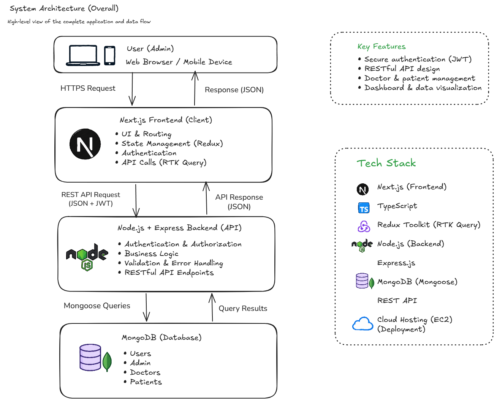
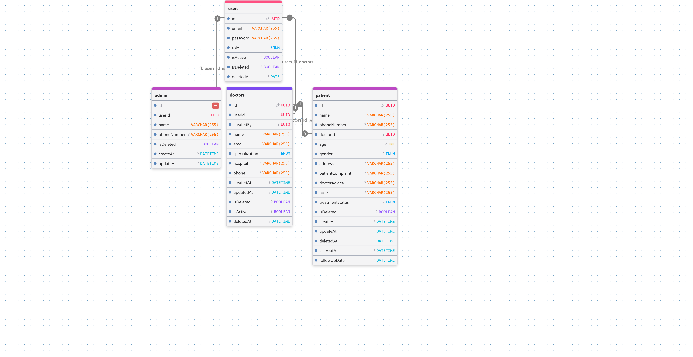

# Doctor Tracker – Backend

REST API for Doctor Tracker, providing authentication and role-based authorization, doctor and patient management, dashboard summaries, request validation, and MongoDB persistence.

## API Base URL

- Production (configured in the related frontend; availability not verified): `https://api-doctor.iblossomlearn.org/api/v1`
- Local: `http://localhost:5000/api/v1` (default port; configurable through `PORT`).
- Health check: `GET /health`, outside the API prefix.

## Main Features

- JWT login and refresh tokens, bcrypt password hashing, profile retrieval, and password changes.
- Role-protected routes: doctor management and dashboard access for admins; patient management for admins and doctors.
- Doctor and patient CRUD with soft deletion; patients reference their assigned doctor.
- Server-side search, filtering, sorting, pagination, and doctor/patient statistics.
- Dashboard follow-up counts, active doctor counts, six-month patient/follow-up trends, and treatment status summaries.
- Zod validation, centralized JSON errors and 404 responses, CORS, Helmet, rate limiting, compression, and Winston logging.

## Tech Stack

- Node.js, Express, TypeScript; tsx/nodemon for development and Babel for builds.
- MongoDB and Mongoose for persistence, transactions, and aggregation.
- Zod, jsonwebtoken, bcryptjs, and node-cache for validation, authentication, and cached user lookups.

## Project Structure

```text
src/
├── app.ts / server.ts     # HTTP middleware and startup/shutdown
├── app/
│   ├── config/            # Environment, database, CORS
│   ├── core/abstract/     # Shared route/controller/service foundations
│   ├── modules/           # Auth, users, admins, doctors, patients, dashboard
│   ├── middlewares/       # Authentication, validation, error handling
│   ├── routes/            # API route registration
│   └── seed/              # Local database seed script
├── helper/                # JWT and authentication cache helpers
└── utils/                 # Shared utilities
docs/                      # Architecture and schema diagrams
```

## System Architecture



The related Next.js frontend sends REST requests to Express. Routes validate requests and delegate to services, which query MongoDB through Mongoose.

## Database Schema



Editable sources: [architecture](./docs/system-architecture.excalidraw) and [ERD](./docs/ERD_Diagrams.json).

## Data Model Overview

- **Users:** login identity, hashed password, role, active status, and soft-delete metadata. Email is unique; passwords are excluded from normal queries and JSON serialization.
- **Admins:** administrator profiles with a unique `userId` reference to Users.
- **Doctors:** unique `userId`, a `createdBy` user reference, registration number, specialization, hospital, and active/deleted status. Registration numbers have a partial unique index, including for deleted records.
- **Patients:** required `doctorId` reference, demographics, complaint/advice, treatment status, visit/follow-up dates, and soft-delete metadata.

## API Documentation

TODO: Add a Postman collection or OpenAPI document; neither is present in this checkout. `docs/DoctorTracker.postman_collection.json` is also absent.

Routes are mounted under `/api/v1` in [the route registry](./src/app/routes/index_route.ts), with feature routes and validation schemas under [modules](./src/app/modules/).

## Setup Guide

Requirements: Node.js **18+** (package engine; Docker uses Node.js 22.18.0), **pnpm 10.33.0**, and a MongoDB **replica set or Atlas cluster**. Admin/doctor creation and seeding use transactions, so a standalone MongoDB instance is insufficient for those operations.

```sh
git clone https://github.com/sampod76/doctor-tracker-server.git
cd doctor_tracker_server
pnpm install
```

Copy the environment template:

```powershell
# PowerShell
Copy-Item .env.example .env
```

```sh
# macOS / Linux
cp .env.example .env
```

Fill the required variables below, then start development:

```sh
pnpm dev
```

Optional local bootstrap: inspect [the seed script](./src/app/seed/seed.ts), set `SEED_DOCTOR_MEDICAL_REGISTRATION_NO` to the seed doctor's real registration number, then run `pnpm seed` against a local development database. The script contains fixed development accounts; review them before use.

Build and run the compiled server:

```sh
pnpm build
pnpm start
```

`build` checks TypeScript and compiles into `dist/`; `start` runs `dist/server.js`. Set `NODE_ENV=production` for production behavior. Other scripts: `pnpm tsc:check`, `pnpm lint:check`, and `pnpm test`. Jest tooling is configured, but the current `tests/` directory contains no test files.

## Environment Variables

Use [.env.example](./.env.example); it contains variable names and no credentials. Required values are `MONGODB_URI`, `JWT_SECRET`, and `JWT_REFRESH_SECRET`. Each JWT secret must contain at least 16 characters; choose separate random secrets.

Optional entries are commented out so [environment validation](./src/app/config/env.ts) can apply defaults. Uncomment only entries you configure; blank numeric or enum values can fail validation.

| Variables                                                       | Purpose / default                                                                              |
| --------------------------------------------------------------- | ---------------------------------------------------------------------------------------------- |
| `NODE_ENV`, `PORT`                                              | Runtime mode (`development`) and port (`5000`)                                                 |
| `MONGODB_DNS_SERVERS`                                           | Optional comma-separated DNS server IPs; connection code otherwise uses public DNS resolvers   |
| `JWT_EXPIRES_IN`, `JWT_REFRESH_EXPIRES_IN`                      | Token lifetimes in seconds: `604800` / `2592000`                                               |
| `BCRYPT_SALT_ROUNDS`                                            | Hashing cost: `12` (allowed range 4–15)                                                        |
| `CORS_ORIGIN`                                                   | Comma-separated origins; default `*`, plus origins configured in source                        |
| `RATE_LIMIT_WINDOW_MS`, `RATE_LIMIT_MAX`                        | Rate window and maximum requests: `60000` ms / `200`                                           |
| `LOG_LEVEL`                                                     | Logging level: `info`                                                                          |
| `SMTP_HOST`, `SMTP_PORT`, `SMTP_USER`, `SMTP_PASS`, `SMTP_FROM` | Optional mail configuration; the utility selects ports by runtime mode rather than `SMTP_PORT` |
| `ENCRYPTION_KEY`, `ENCRYPTION_SECRET`                           | Optional encryption utilities; not required by registered API routes                           |
| `SEED_DOCTOR_MEDICAL_REGISTRATION_NO`                           | Required when creating/backfilling the seed doctor                                             |

## Technical Decisions

### 1. Database-side search and pagination

Doctor and patient lists apply `$match` in MongoDB, then use `$facet` to return paginated data and a total count in one aggregation. Sorting adds `_id` for stable ties, page size is capped at 100, and `$lookup` runs after `$skip`/`$limit` so enrichment is restricted to the requested page. This avoids loading all matching records into application memory; regex search still needs query-plan evaluation at larger scale.

### 2. Centralized validation and error handling

Feature routes share Zod middleware that parses bodies, query parameters, and IDs before controllers execute. A single error handler translates validation, Mongoose, duplicate-key, JWT, and domain errors into JSON responses, while hiding stack traces in production. This keeps doctor, patient, and authentication routes consistent without repeating error translation in every controller.

## Performance and Optimization

- Doctor indexes cover deletion/creation ordering, specialization/deletion/active status, unique user references, and registration numbers. Patient indexes cover doctor/deletion/creation ordering and doctor/deletion/phone queries.
- Aggregations compute counts and statistics in MongoDB; projections limit response fields, and read-only dashboard/auth queries use `.lean()`.
- Independent dashboard queries run through `Promise.all`; recent-doctor patient counts use a grouped query. Authentication user lookups are cached in-process for 300 seconds.
- Mongoose automatic index creation is disabled in production; provision declared indexes separately. No benchmark results are included.

## Visual Evidence and Related Repository

[Frontend repository](https://github.com/sampod76/doctor-tracking-dashboard) — existing desktop screenshots: [Login](https://github.com/sampod76/doctor-tracking-dashboard/blob/main/docs/screenshots/2.login.png), [Dashboard](https://github.com/sampod76/doctor-tracking-dashboard/blob/main/docs/screenshots/3.dashboard.png), [Doctors](https://github.com/sampod76/doctor-tracking-dashboard/blob/main/docs/screenshots/4.doctors.png), and [Patients](https://github.com/sampod76/doctor-tracking-dashboard/blob/main/docs/screenshots/6.patients.png). These files exist in the adjacent frontend checkout and are maintained there.

TODO: Mobile screenshot needs to be added; no separate mobile screenshot was found. Remote screenshot availability has not been verified.

## Deployment

The repository includes a [Dockerfile](./Dockerfile), [local Compose configuration](./docker-compose.yml), and [production Compose configuration](./docker-compose.pro.yml). Compose maps host port `5052` to container port `5000` and requires an external MongoDB connection.

The [GitHub Actions workflow](./.github/workflows/deploy.yml) builds and pushes an image to GHCR on `main`, then invokes [deploy.sh](./deploy.sh) over SSH. Credentials are supplied through GitHub Actions secrets. These files describe the configured deployment; a successful live deployment has not been verified.
